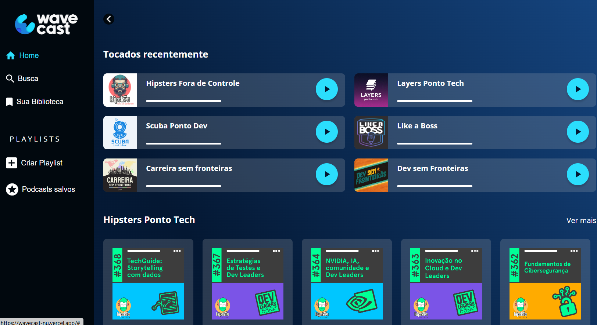

# Wavecast

Uma landing page baseada em um curso da Alura. Projeto se trata de uma página web de podcast.

## 🔨 Funcionalidades do projeto

O projeto foi especificamente focado em grid e flexbox. Está disponível no [Figma](https://www.figma.com/design/OkuJrConH0zKqaz6awMDvd/WaveCast-%7C-Curso-de-Grid?node-id=10701-36&t=6XPBUJfuf0f3GXMz-0) para versões mobile, tablet e desktop.

## ✔️ Técnicas e tecnologias utilizadas

-`HTML`
-`CSS``
-`Acessibilidade Web`
-`Figma`

## 🛠️ Abrir e rodar o projeto

Para abrir e rodar o projeto, utilize um editor de código de sua escolha.
Depois, abra o projeto no seu navegador.

## VERCEL 
https://wavecast-nu.vercel.app/
